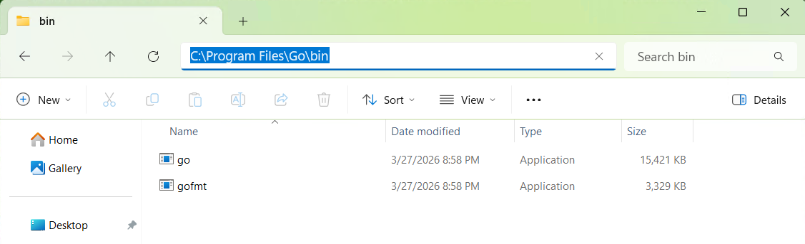
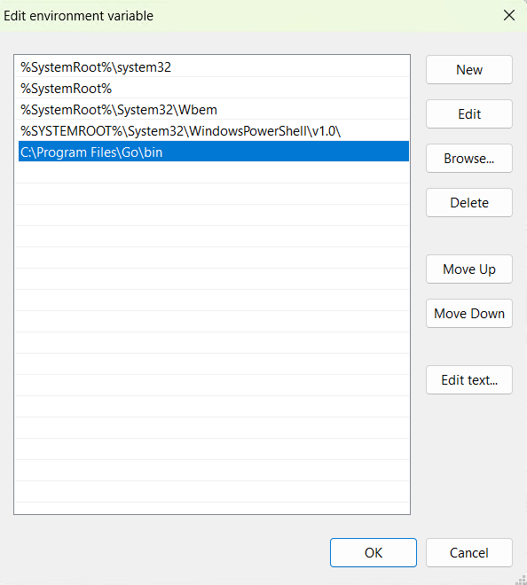

# Adding Go to Path

This page will teach you how to add `Go` to Path. It follows the same steps as adding ``make`` and ``protoc`` in the guide section.

## 1 - Locate the Go installation folder

Navigate to the folder `Go\bin` and copy it's location.

{ loading=lazy }

!!! note
    If you installed Go with default settings the path will be `C:\Program Files\Go\bin`. If you installed it in another place copy that location.
	
## 2 - Open the System Settings

Open the Settings App. Select System>About and Advanced System Settings.

{ loading=lazy }

Press the Environment Variables button. Next double click on Path.

{ loading=lazy }

Press the New button and paste the location from above.

{ loading=lazy }

Press the Ok button in the windows to apply the settings.

## 3 - Checking if the Command Works

!!! note
    If you have the`Command Prompt` open, for any reason, close it and re-open it or the commands won't work.
	
Open the `Command Prompt`, type `go` and press enter.

{ loading=lazy }

The command should work now, like in the image above.