# Static IP Guide

In order to create a server that others can connect to, you need a `Static IP` address. Without a `Static IP`, the IP address can change on its own, which would require you to change the server IP and patch the APK again.

This section of the guide will teach you how to change to a `Static IP` address.

!!! warning
    The "Advanced Users" portion of the guide requires access to your home router. If you have never done this before, it is better to use a tool like `Tailscale`. Otherwise, you might mess up your internet settings. This warning will appear again before the section.

## 1 - Static IP via Windows Network Settings (Beginner Friendly)

The easiest way to set a static IP is in the Windows Network Settings. This avoids messing with your internet router and it's easy to fix if something doesn't work.

!!! info
    This doesn't always work. Some ISPs only allow you to create a static IP address from within the router software. See the next section of the guide to learn how to do this.

### 1.1 - Open the Command Prompt

Open the `Command Prompt` by typing cmd in Windows Search.

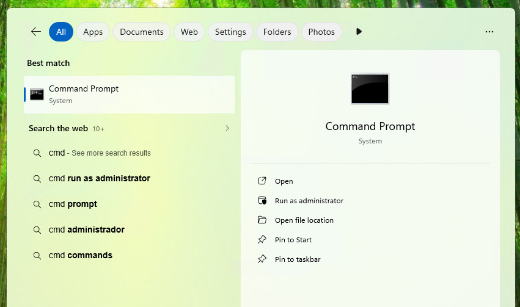{ loading=lazy }

### 1.2 - Getting your router LAN IP and your computer IP

Type `ipconfig` in the `Command Prompt` and press Enter.

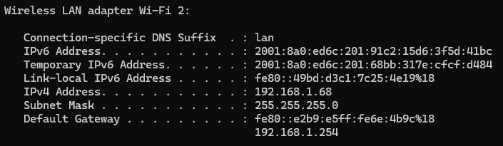{ loading=lazy }

Since I'm using a Wi-Fi connection, my IP address appears under `Wireless LAN adapter Wi-Fi`. If you are using a cable connection, it will appear under `Ethernet adapter`.

!!! note
    Your IP address will be different from the one shown in the images. Use the IP address that appears in your `Command Prompt`.
	
Copy the `IPv4 Address`, `Default Gateway` and `Subnet Mask` IPs and paste them in notepad.

``` batch
IPv4 Address: xxx.xxx.xxx.xxx        #Computer IP
Default Gateway: xxx.xxx.xxx.xxx     #Router LAN IP
Subnet Mask: xxx.xxx.xxx.xxx
```

### 1.3 - Changing your network settings

Open the Control Panel and select Network and Internet.

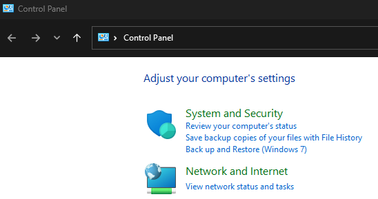{ loading=lazy }

Select Network and Sharing Center.

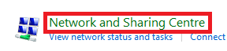{ loading=lazy }

Click on your Internet Connection.

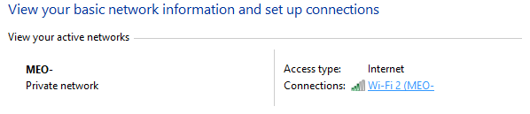{ loading=lazy }

Next click on Properties and double click the IPv4 protocol.

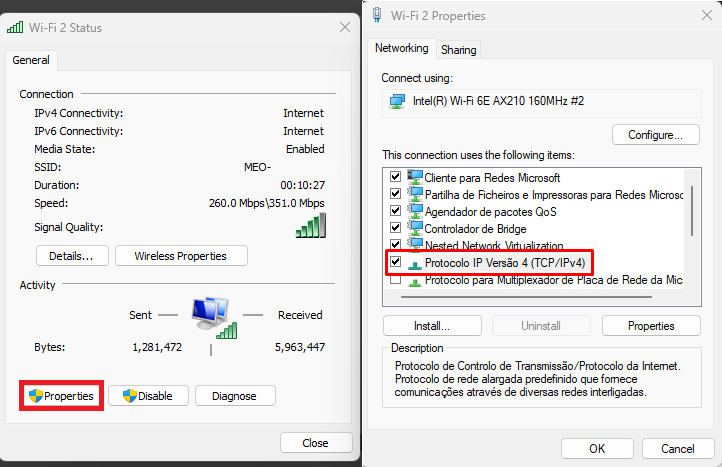{ loading=lazy }

Copy and paste the respective IPs and press Ok.

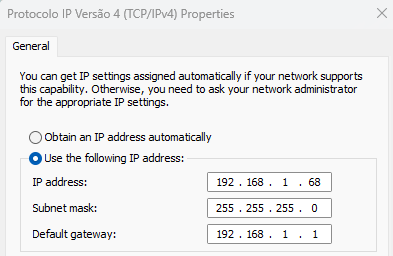{ loading=lazy }

If you get this message press Yes.

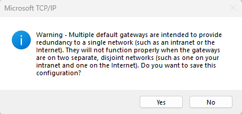{ loading=lazy }

!!! note
    As mentioned in the beginning, this might not work. If your internet connection stops working after you change these settings, simply revert them to the automatic settings.
	
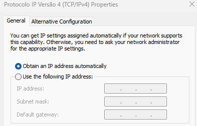{ loading=lazy }
	
!!! warning
    The "Advanced Users" portion of the guide requires access to your home router. If you have never done this before, it is better to use a tool like `Tailscale`. Otherwise, you might mess up your internet settings.
	
## 2 - Static IP via Router Settings (Advanced Users)

The process of changing to a static IP via router varies between ISPs and router manufacturers. I will use my old home router (an Asus RT-AC51U) as an example. This will give you a rough idea on how to do it.

!!! tip
    If you mess up your router settings, don't worry. They all have a reset button, which is a tiny hole that you can press with a toothpick. Pressing it will restore the default settings.
	
And rememeber to check your router manufacturer website. Some have detailed guides on how to do this process.

### 2.1 - Log in to your Router.

Copy the `Default Gateway` IP adress you got earlier in the guide and paste it on your web browser.

!!! note
    Your IP address will be different from the one shown in the images. Use the IP address that appears in your `Command Prompt`.
	
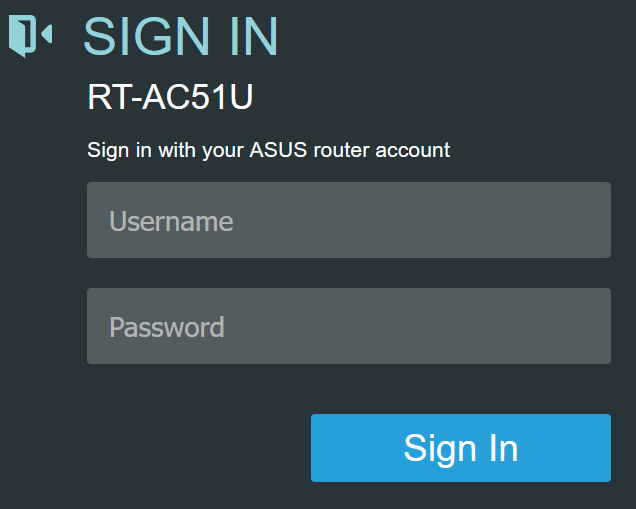{ loading=lazy }

The login page should load. Enter your username and password. Many routers have "admin" as the default username and password. Try that to see if it works. If not, search for your router model online.

``` batch
username: admin
password: admin
```

### 2.2 - LAN settings

Select LAN in the Advanced Settings.

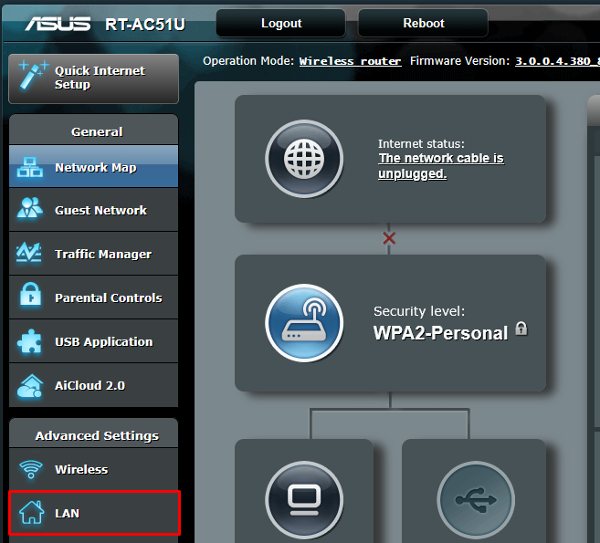{ loading=lazy }

Select the DHCP tab and look for the higlited section.

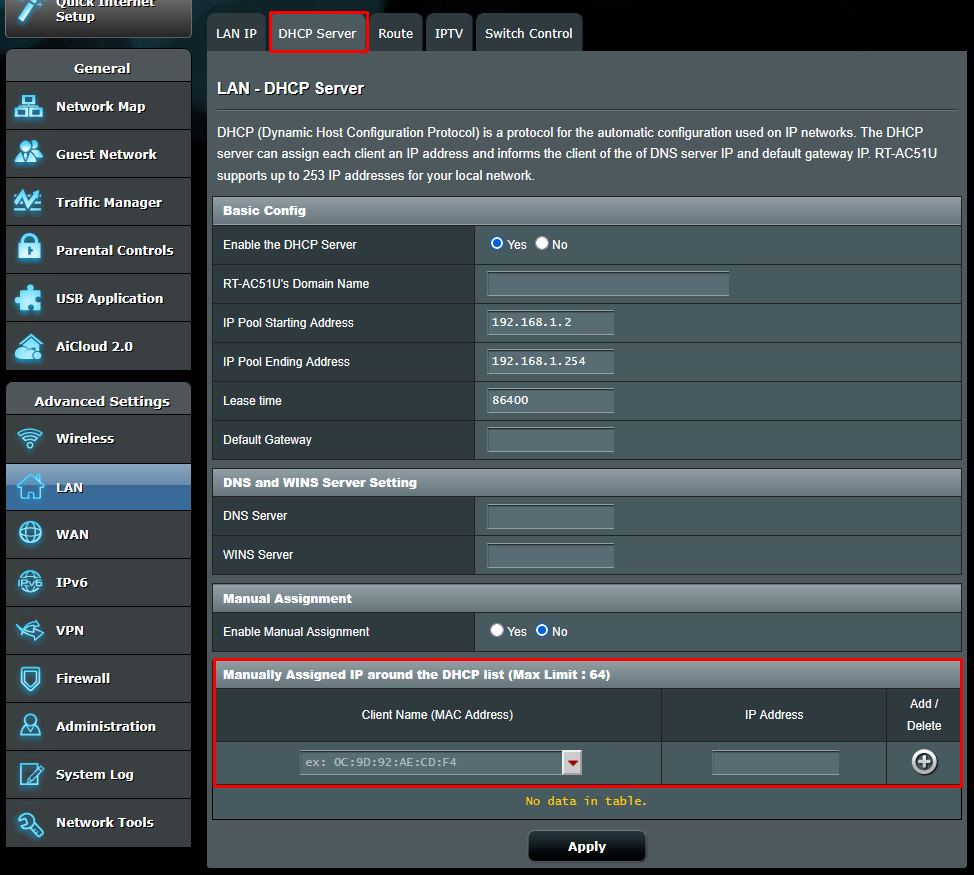{ loading=lazy }

### 2.3 - MAC Address and Static IP

!!! danger
    Under no circumstances should you ever share your `MAC address` with anyone. Doing so will compromise your security. No exceptions. 

Select your computer from the drop down menu. My computer is called "Gongaga".

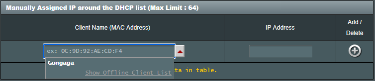{ loading=lazy }

If you don't know your device name you can input your `MAC address`. To get your address open the `Command Prompt` and copy and paste the following:

``` batch
ipconfig /all
```

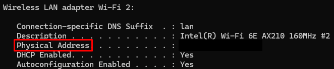{ loading=lazy }

Look for `Physical Address`. Copy and paste it in the "Client Name (MAC Address)".

Next copy and paste your IP adress. Afterwards press the "+" button to add.

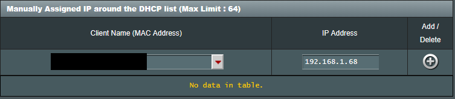{ loading=lazy }

You will see your computer with the assigned IP adress. Press apply and wait.

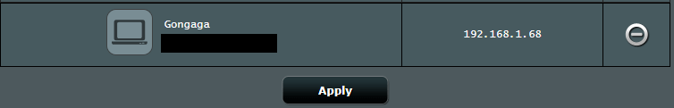{ loading=lazy }
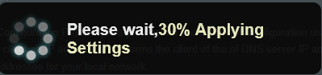{ loading=lazy }

!!! success
    Now that you have a `Static IP` address, you can move on to the next step: `Port Forwarding`. Refer to the next section of the guide to continue.