# Public IP, Server Settings and new APK

We now only need to get our Public IP, update our server settings and build a new APK.

!!! danger
    Be careful about sharing your `Public IP`. It can compromise your security. Be safe.
	
## 1 - Getting your Public IP

Open the website [What Is My IP Address](https://whatismyipaddress.com/).

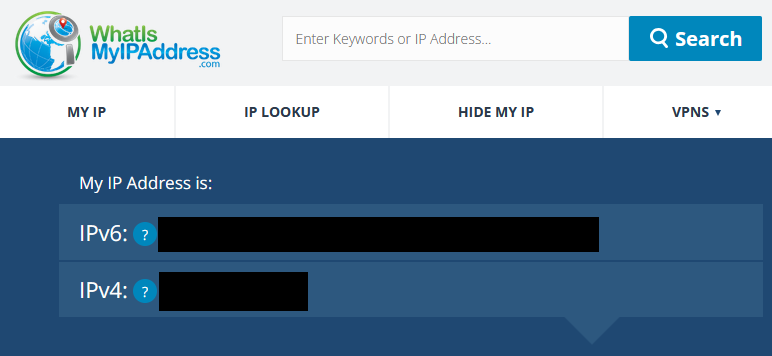{ loading=lazy }

And copy the IPv4 address.

## 2 - Updating the Server Settings

### 2.1 - Open the `nier` folder and type `cmd` to open the `Command Prompt`

{ loading=lazy }
{ loading=lazy }

### 2.2 - Run the Wizard and Update your IP

Copy and paste the following commands:
```batch
cd server
go run ./cmd/wizard
```
{ loading=lazy }

A prompt will appear asking if you want to use the same settings as before, select "No, reconfigure".

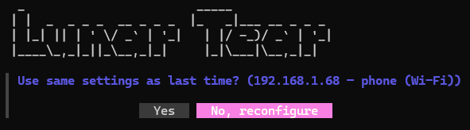{ loading=lazy }

Select "Phone / Tablet on the same network" and press Enter.

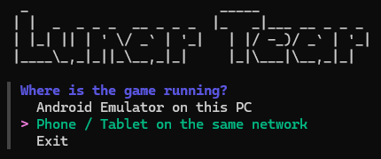{ loading=lazy }

Next select "Something else / I'll type the IP" and press Enter.

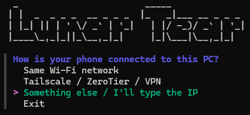{ loading=lazy }

Paste your `Public IP` and press Enter.

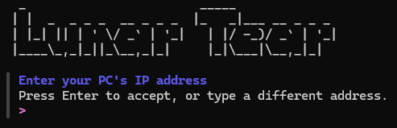{ loading=lazy }

Finally chose "Yes, start".

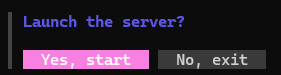{ loading=lazy }

!!! success
    Your server is now running with your `Public IP`!

## 3 - Patching the APK

!!! note
    This is an abridged version of the main setup guide. If you encounter any difficulties, please refer to [Step 5](Setup.md/#step-5-patching-with-google-colab) of the Server Setup Guide.
	
### 3.1 - Open the Website [Google Colab](https://colab.research.google.com) and open `lunar_tear_patcher.ipynb`

{ loading=lazy }

### 3.2 - File Source

Copy and paste the command in the `apk_source`.

```batch
MyDrive/NieR Re[in]carnation 3.7.1.apk
```

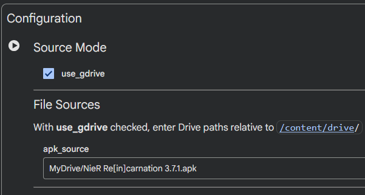{ loading=lazy }

### 3.3 - Server IPs

!!! note
    Remember to use your own IPs. Not the ones in the images.
	
```batch
grpc_addr = "xxx.xxx.xxx.xxx:8003"
http_addr = "xxx.xxx.xxx.xxx:8080"
auth_host = "xxx.xxx.xxx.xxx:3000"
```

Copy and paste your `Public IP` in each field.

{ loading=lazy }

### 3.4 - Run the Patches

Press the Run button next to "Configuration".

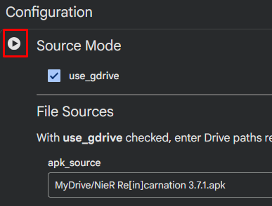{ loading=lazy }

Allow access to your Google Drive and let the patch run.

{ loading=lazy }

Next, press the Run button next to "Install dependencies" and let the patch run.

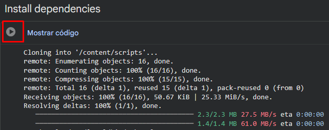{ loading=lazy }

Do the same in the "Patch APK" section and let it run.

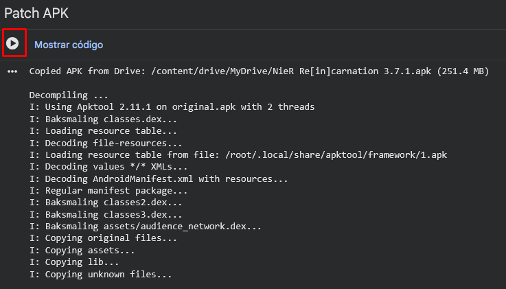{ loading=lazy }

When the patching ends a new folder will appear in your drive named `lunar-tear-output`. Open the folder and download your new APK.

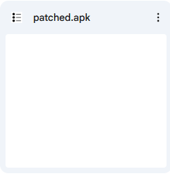{ loading=lazy }

!!! success
    You now have the new APK ready to be installed and to connect to your server! 
	
## 4 - Enjoy playing with your friends in your server

!!! success
    Everything is ready now! Have fun playing with your friends!
	
!!! tip
    Should you ever need to change your server IP again, simply repeat the above steps.
	
