# Setup Guide
## Prerequisites

The prerequisites include both tools/programs and the server files.

**Name** | **Link**
--- | --- 
**lunar-tear-main.zip** | [Github server repo](https://github.com/Walter-Sparrow/lunar-tear)
**lunar_tear_patcher.ipynb** | [Gitlab scripts repo](https://gitlab.com/walter-sparrow-group/lunar-scripts/-/blob/main/lunar_tear_patcher.ipynb?ref_type=heads)
**resource_dump_android.7z** | [Archive.org torrent file](https://archive.org/download/nier_reincarnation_assets/nier_reincarnation_assets_archive.torrent)
**NieR Re[in]carnation 3.7.1.apk** | [Pixel Drain](https://pixeldrain.com/u/2Lxhjybb) or [Torrent](https://cdn.discordapp.com/attachments/1493138253719797876/1497232940940136478/NieR_Reincarnation_3.7.1.apk.torrent?ex=69ee17d6&is=69ecc656&hm=42387f276fa30059f1d935494687b238e150cbf8b07b10cc181f5a71710453be&)
**20240404193219.bin.e** | [Mega Link](https://mega.nz/file/Fw4ExbTb#EVZVwvjV8-w-lBgWazHSUmGJdGfZtndCOaDDGA57cmE)
**Go 1.25+** | [go.dev](https://go.dev/dl/)
**Protoc** | [Github protoc repo](https://github.com/protocolbuffers/protobuf/releases)
**Make** | [Make](https://sourceforge.net/projects/gnuwin32/files/make/3.81/make-3.81.exe/download)

!!! Tip
    To extract `.zip` and `.7z` I recommend [Winrar](https://www.win-rar.com/download.html?&L=0) or [7zip](https://www.7-zip.org/download.html). To download the torrent file I recommend [qBittorrent](https://www.qbittorrent.org/download).
	
!!! warning
    If you downloaded the APK from the APK Pure link, re-download it with the new links. 


## Folder Structure

The folder structure doesn't include most files since they come together with the .zip files. Everything will be explained together with pictures.

    nier/                     # The root folder of the guide.               
		server/               # Server repo (https://github.com/Walter-Sparrow/lunar-tear)
			assets/
				release/
				revisions/
			cmd/
			internal/
			migrations/
			proto/
    20240404193219.bin.e
	NieR Re[in]carnation 3.7.1.apk
	lunar_tear_patcher.ipynb  # Scripts repo (https://gitlab.com/walter-sparrow-group/lunar-scripts)
	resource_dump_android.7z


## Step 1 - Download the Prerequisites

###1.1 - Download `lunar-tear-main.zip` from the server repo.

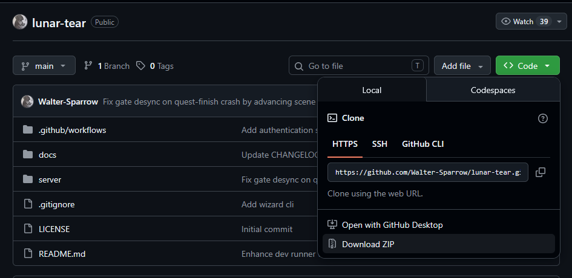{ loading=lazy }

###1.2 - Download `lunar_tear_patcher.ipynb` from the scripts repo.

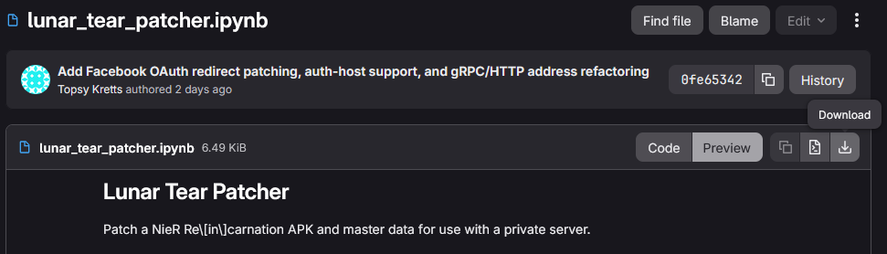{ loading=lazy }

###1.3 - Download `resource_dump_android.7z` with qBittorrent.

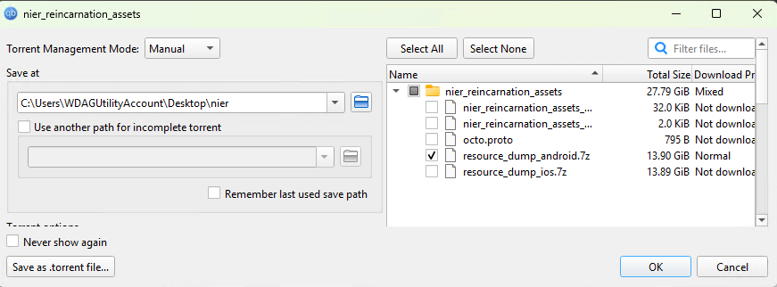{ loading=lazy }

###1.4 - Download `NieR Re[in]carnation 3.7.1.apk`.

{ loading=lazy }

###1.5 - Download `20240404193219.bin.e`.

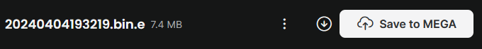{ loading=lazy }

###1.6 - Download  `go1.26.2.windows-amd64.msi` from the official website.

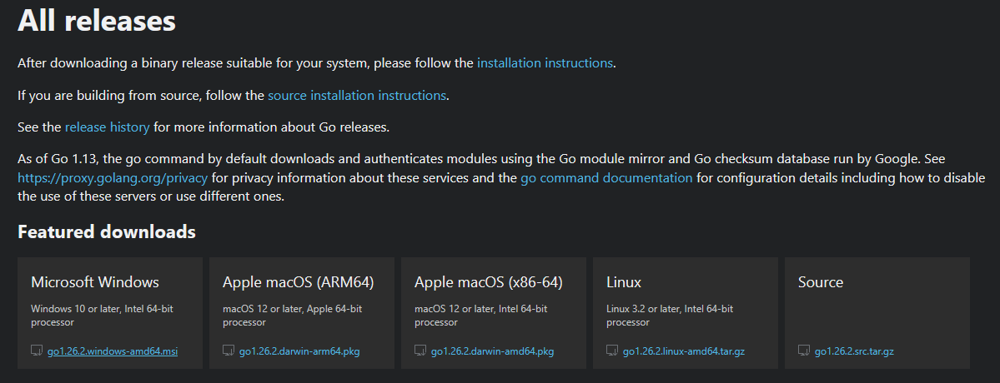{ loading=lazy }

###1.7 - Download `protoc-35.0-rc-1-win64.zip` from the Github Protoc Repo.

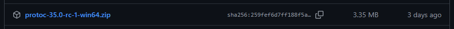{ loading=lazy }

###1.8 - Download `make-3.81.exe` from the official website.

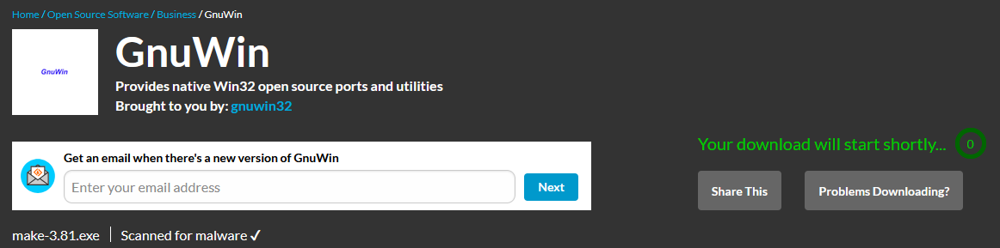{ loading=lazy }

## Step 2 - Adding to Path

###2.1 - Go

2.1.1 - Open `go1.26.2.windows-amd64.msi` and install it by pressing Next. Go should automatically add itself to Path.

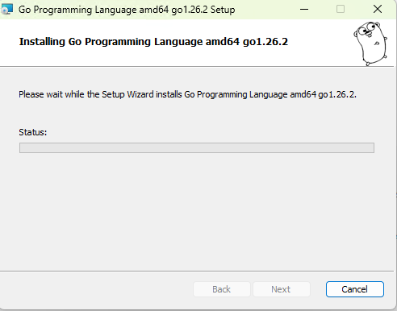{ loading=lazy }

!!! note
    If the `go` command doesn't work after installing. Check this [page](Go_troubleshooting.md).

###2.2 - Protoc

2.2.1 - Extract `protoc-35.0-rc-1-win64.zip`

!!! Tip
    Extract the files to a safe location, so you don't delete them accidentally later.

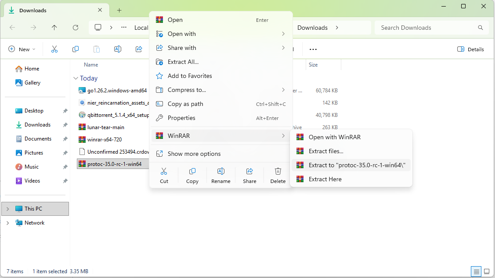{ loading=lazy }

2.2.2 - Navigate to `protoc-35.0-rc-1-win64\bin` and copy the location.

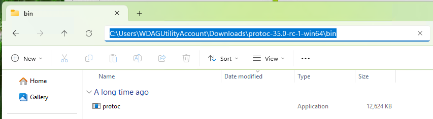{ loading=lazy }

2.2.3 - Open the Settings App. Select System>About and Advanced System Settings.

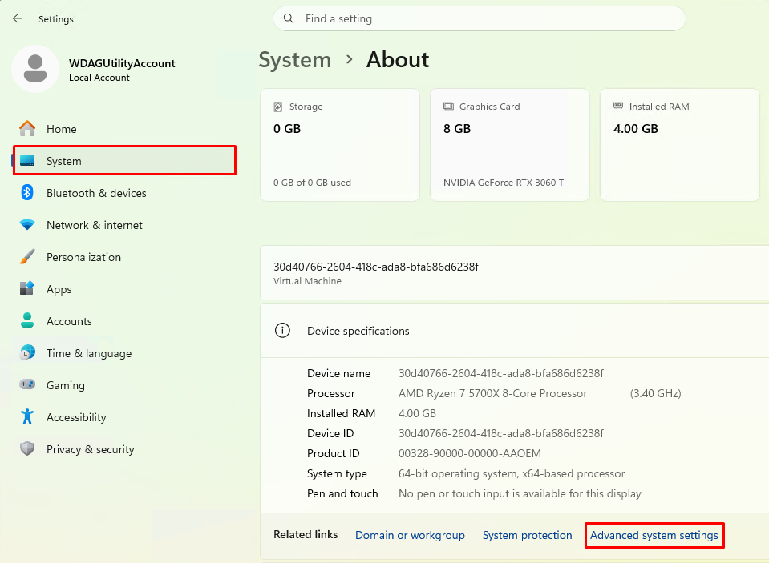{ loading=lazy }

2.2.4 - Press the Environment Variables button. Next double click on Path.

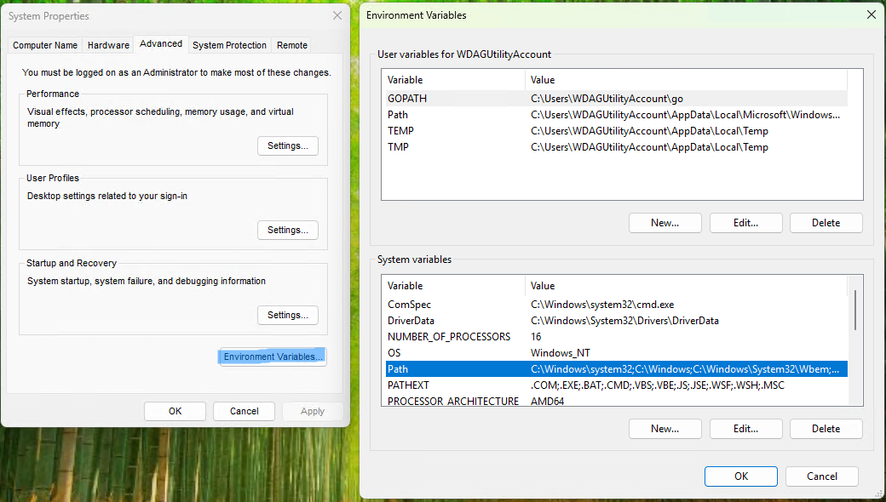{ loading=lazy }

2.2.5 - Press the New button and paste the location from 2.2.2. Don't close the window yet.

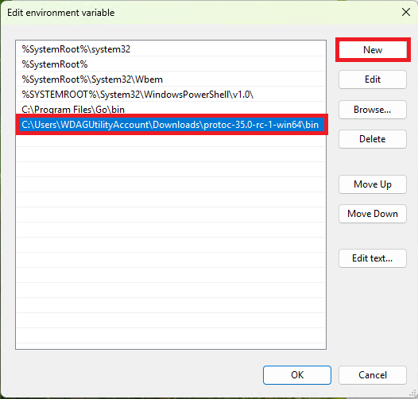{ loading=lazy }

###2.3 - Make

2.3.1 - Open `make-3.81.exe` and install it by pressing Next.

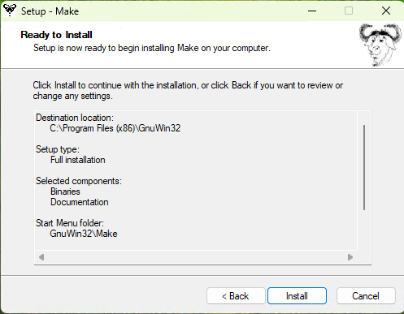{ loading=lazy }

2.3.2 - Navigate to `C:\Program Files (x86)\GnuWin32\bin` and copy the location.

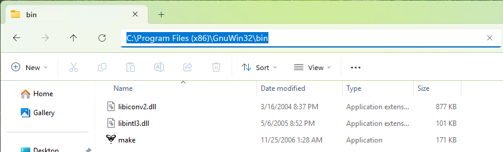{ loading=lazy }

2.3.3 - Go back to the window we oppened on 2.2.5 and do the same with the location.

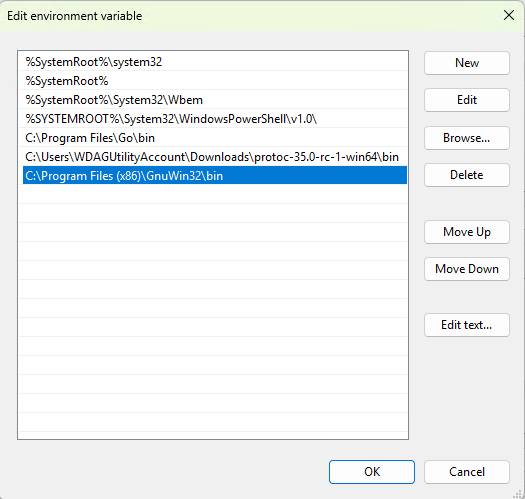{ loading=lazy }

You can now press Ok in the various windows to apply the Path.

###2.4 - Checking if everything worked

!!! note
    If you have the`Command Prompt` open, for any reason, close it and re-open it or the commands won't work.

2.4.1 - Open the `Command Prompt`, type `go` and press enter.

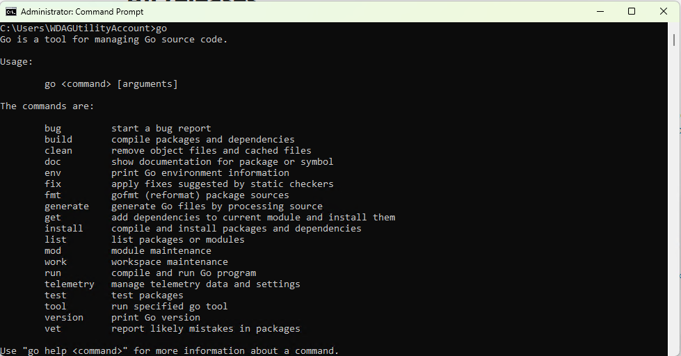{ loading=lazy }

2.4.2 - Next type `protoc` and press enter.

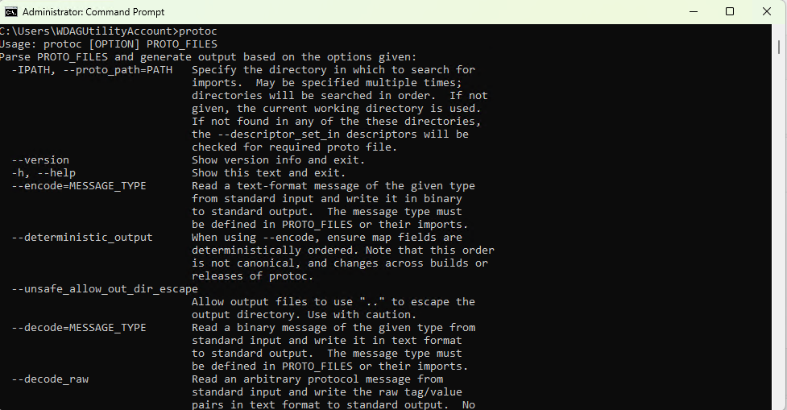{ loading=lazy }

2.4.3 - Lastly type `make` and press enter.

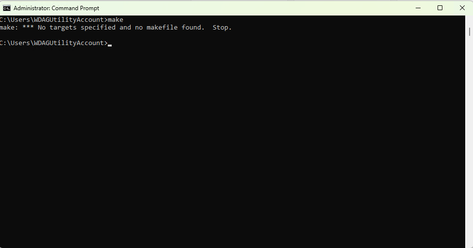{ loading=lazy }

If all the 3 commands showed up like in the images above, everything is good to go.

##Step 3 - Setup the Server Folder

###3.1 - Create a folder named `nier`

!!! note
    After you create the `nier` folder, move `20240404193219.bin.e`, `resource_dump_android.7z`, `NieR Re[in]carnation 3.7.1.apk` and `lunar_tear_patcher.ipynb` to it.

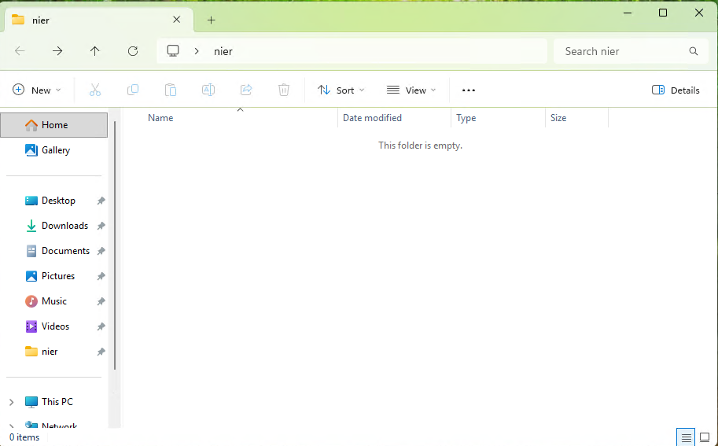{ loading=lazy }

###3.2 - Open the `Command Prompt` in the `nier` folder. To do this type `cmd` like in the image. Don't close the `Command Prompt`.

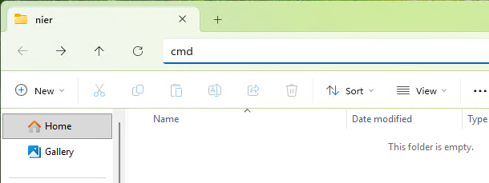{ loading=lazy }
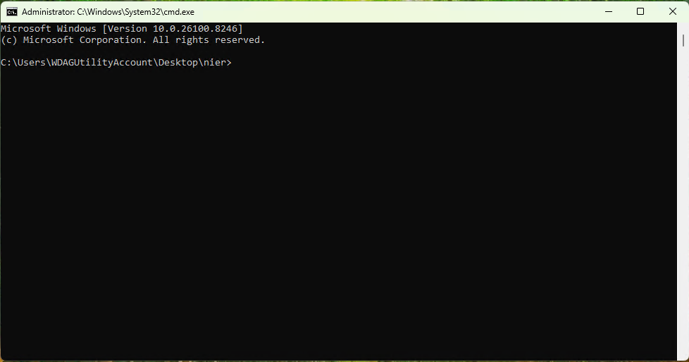{ loading=lazy }

###3.3 - Copy the commands bellow, one by one, to create the necessary folders. Or you can do it manually.

``` batch
mkdir "server/assets/release"
mkdir "server/assets/revisions"
```
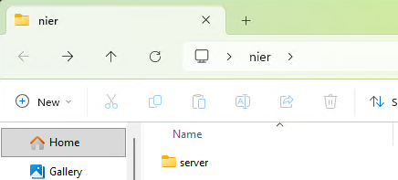{ loading=lazy }
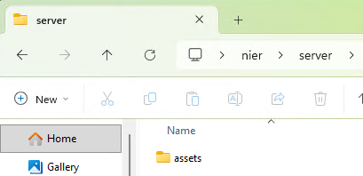{ loading=lazy }
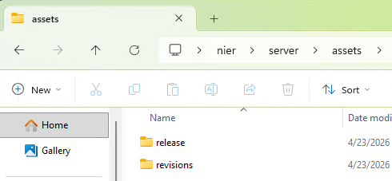{ loading=lazy }

###3.4 - Open the `lunar-tear-main.zip` and extract the server folder to the nier folder.

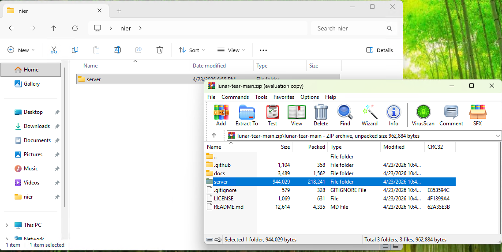{ loading=lazy }
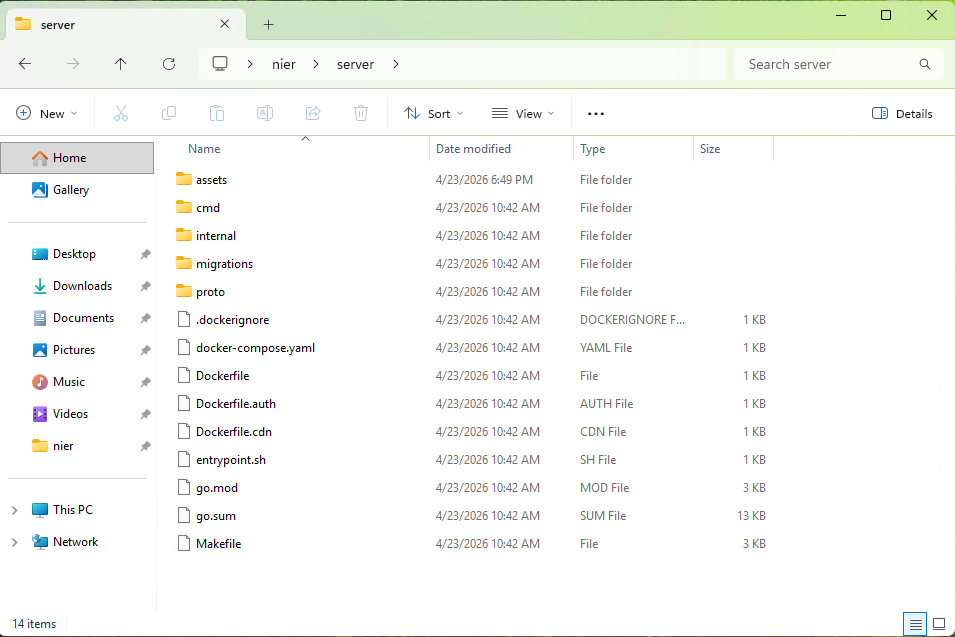{ loading=lazy }

###3.5 - Go to the `nier\server\assets\revisions` folder. After that open `resource_dump_android.7z\revisions` and extract the folder 0. This will take some time.

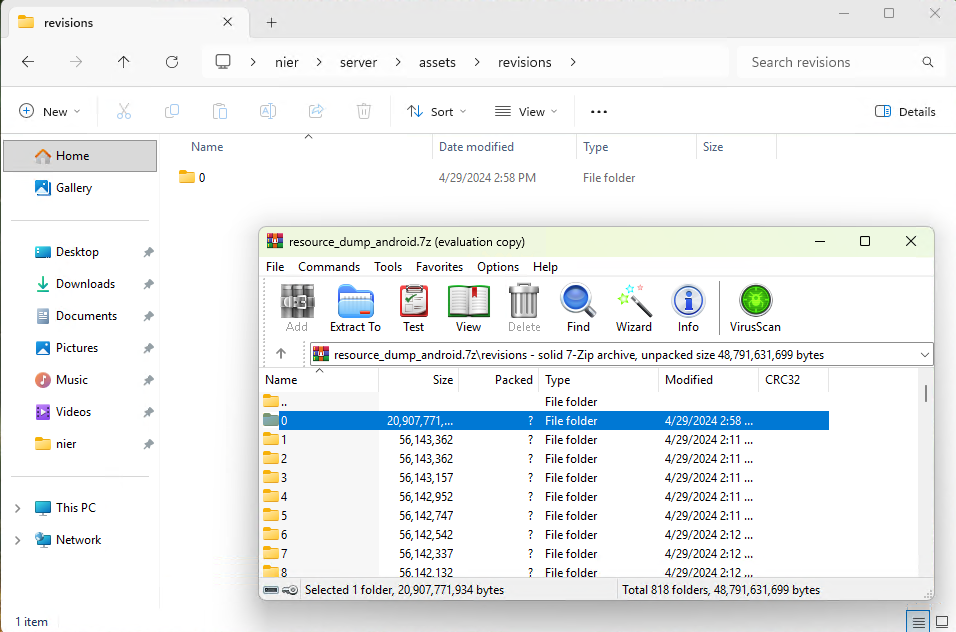{ loading=lazy }

!!! Tip
    Everything should be ready to go. If for some reason something fails, check the folder structure and give the guide another look.

##Step 4 - Getting your IP

###4.1 - Go back to the `Command Prompt` in the `nier` folder we oppened on 3.2 and enter the following commands one at the time.

``` batch
cd server
go run ./cmd/wizard --setup-only
```
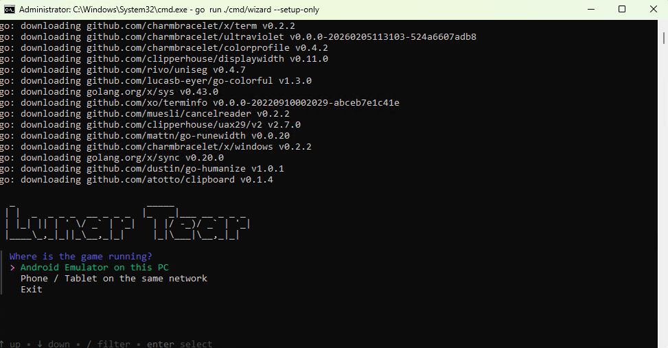{ loading=lazy }

4.1.1 - Android Emulator

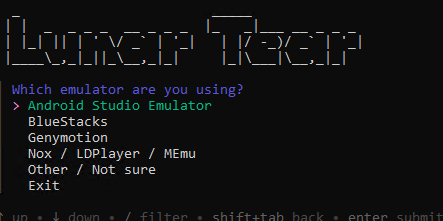{ loading=lazy }

Select the android emulator you are using. If you don't know choose the `Other / Not Sure` option.

4.1.2 - Phone / Tablet

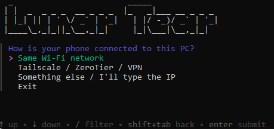{ loading=lazy }

Chose whatever option you intend to use.

!!! note
    If you choose the first option `Same Wi-Fi Network`, remember to use a static IP adress or the IP could change between sessions.
	
###4.2 - After choosing the option, the program will auto detect your IP adress. Press enter.

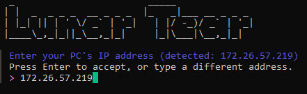{ loading=lazy }
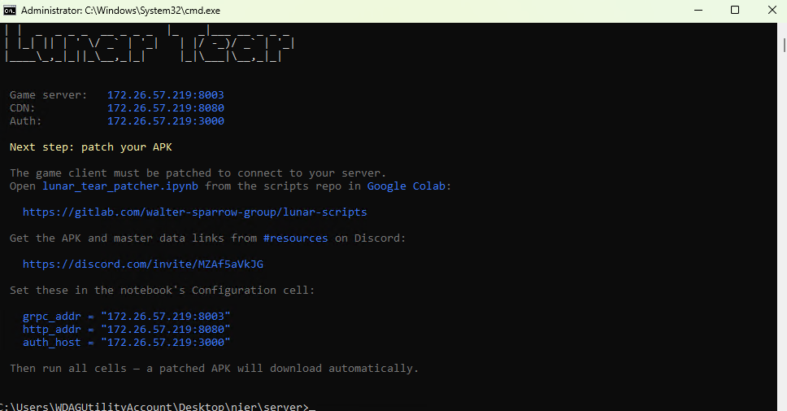{ loading=lazy }

!!! note
    Your IP address will be different from the one shown in the images. Use the IP address that appears in your `Command Prompt`.
	
```batch
grpc_addr = "xxx.xxx.xxx.xxx:8003"
http_addr = "xxx.xxx.xxx.xxx:8080"
auth_host = "xxx.xxx.xxx.xxx:3000"
```

You can either copy and paste directly from the `Command Prompt` or save the IP in a Notebook file on your computer.

##Step 5 - Patching with Google Colab

!!! note
    You must have a Google account to use Google Drive and Google Colab.
	
###5.1 - Upload `20240404193219.bin.e` and `NieR Re[in]carnation 3.7.1.apk` to the root folder of your Google Drive.

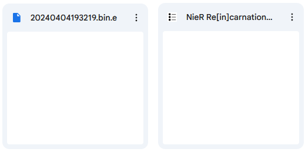{ loading=lazy }

###5.2 - Open the Website [Google Colab](https://colab.research.google.com) and Open `lunar_tear_patcher.ipynb`.

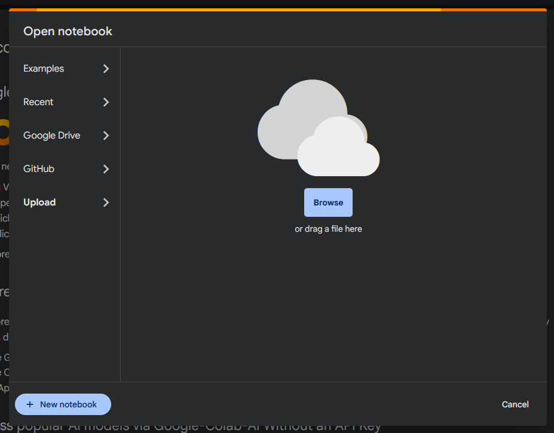{ loading=lazy }

If you are already logged in, this window should pop-up. If not use the next image.

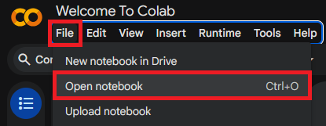{ loading=lazy }

###5.3 - File Sources

Copy and paste the first command in the `apk_source` and the second command in the `masterdata_source`.

```batch
MyDrive/NieR Re[in]carnation 3.7.1.apk
MyDrive/20240404193219.bin.e
```
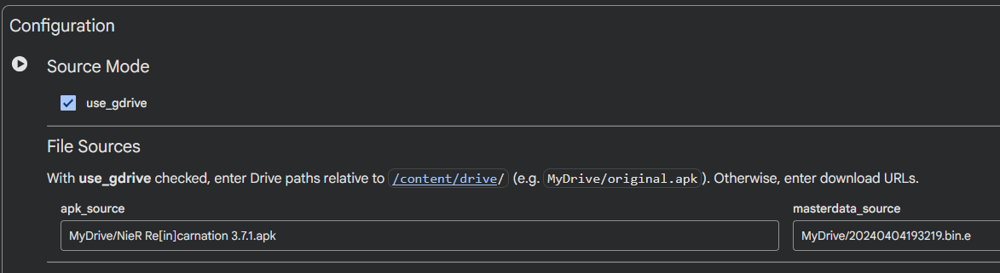{ loading=lazy }

###5.4 - Server IPs

!!! note
    Remember to use your own IPs. Not the ones in the images.
	
```batch
grpc_addr = "xxx.xxx.xxx.xxx:8003"
http_addr = "xxx.xxx.xxx.xxx:8080"
auth_host = "xxx.xxx.xxx.xxx:3000"
```

Copy each IP to the corresponding field.

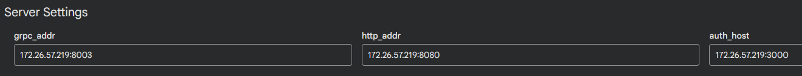{ loading=lazy }

###5.5 - Run the Patch

Press the Run all button.

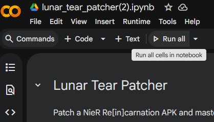{ loading=lazy }

Allow access to your Google Drive and let the patch run.

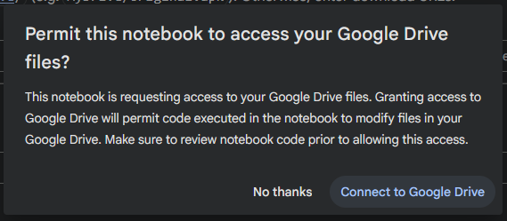{ loading=lazy }

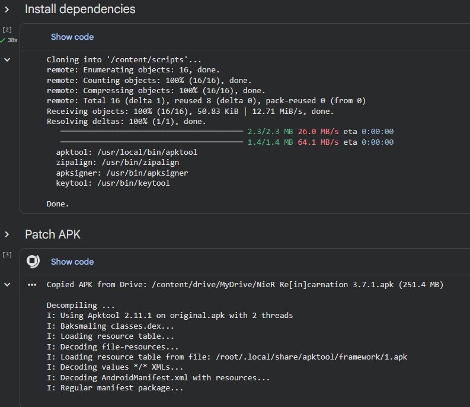{ loading=lazy }

When the patching ends a new folder will appear in your drive named `lunar-tear-output`. Open the folder and download both files.

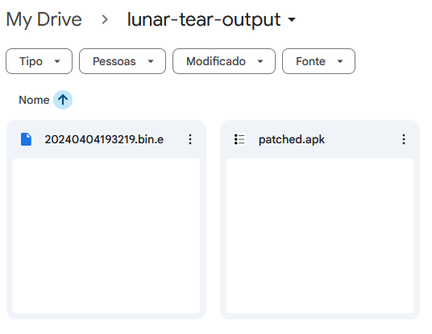{ loading=lazy }

###5.6 - The new `20240404193219.bin.e`

Copy the new `20240404193219.bin.e` to `nier\server\assets\release`.

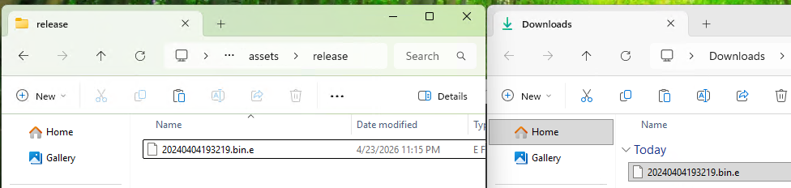{ loading=lazy }

##6 - Running the Server

###6.1 - Open the `Command Prompt` in the `nier` folder again and run the commands below.

```batch
cd server
go run ./cmd/wizard
```

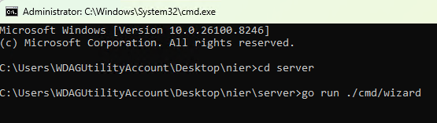{ loading=lazy }

The wizard will download and install dependencies.

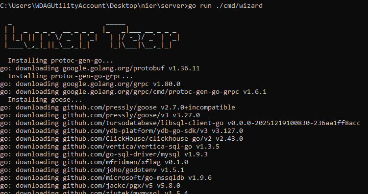{ loading=lazy }

When it ends, a prompt will appear. Select Yes.

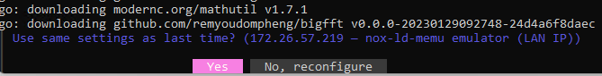{ loading=lazy }

After that 3 windows will appear. Allow access to all of them.

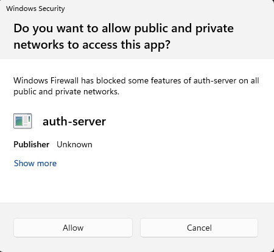{ loading=lazy }
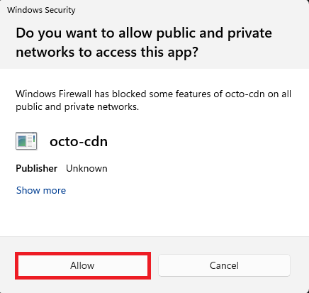{ loading=lazy }
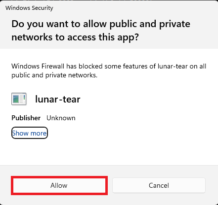{ loading=lazy }

###6.2 - The Server is now working!

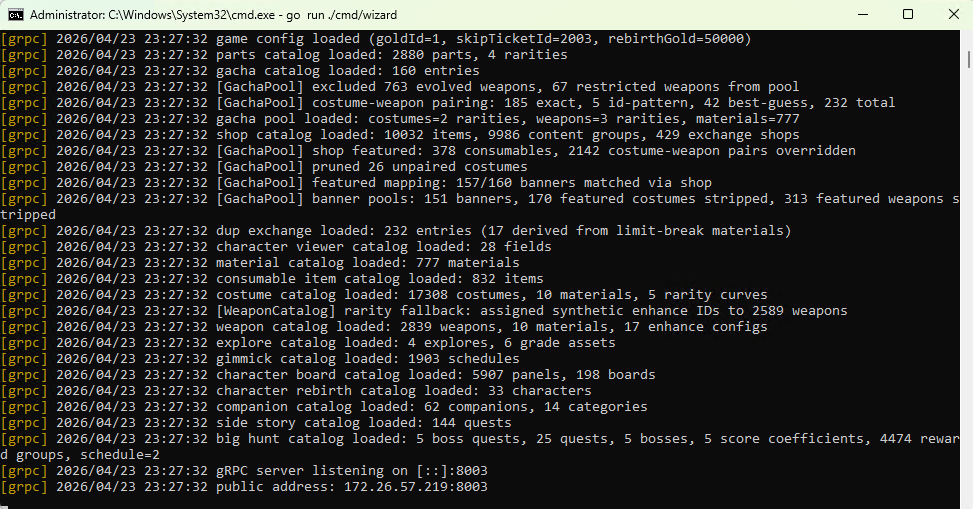{ loading=lazy }

!!! Tip
    You can create a .bat file in the nier folder to run the server. Just copy the commands in 6.1 to a text file and save as `Run_Server.bat`
	
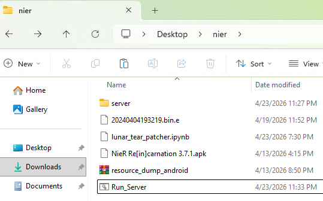{ loading=lazy }

##7 - Installing the Game

###7.1 - Open your android emulator or grab your phone/tablet. And drag and drop `patched.apk`

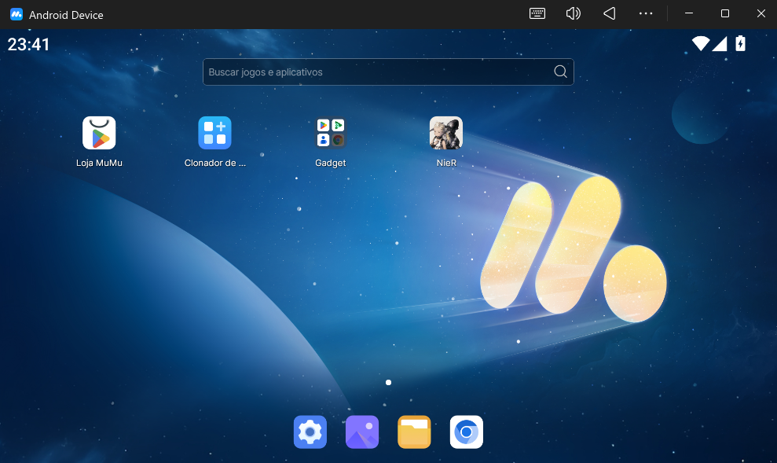{ loading=lazy }

###7.2 - Open the game and Tap Start!

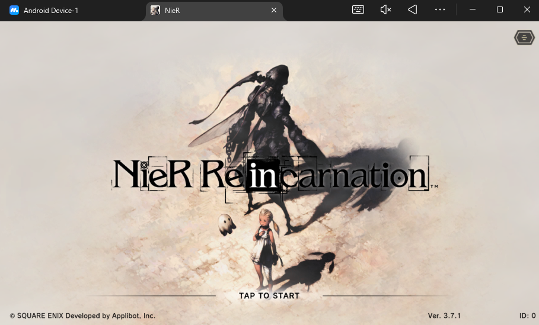{ loading=lazy }

If this screen appears, congratulations, everything is working and you can start playing!

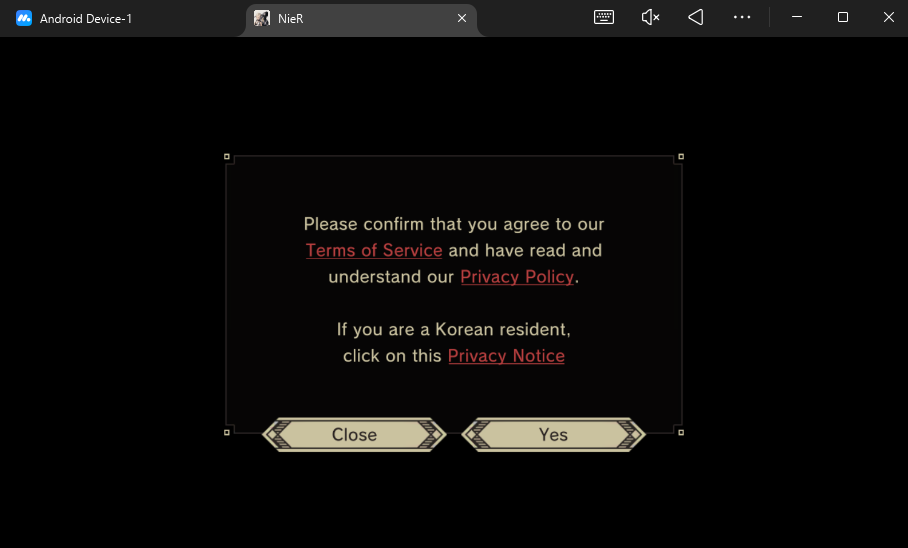{ loading=lazy }

###7.3 - Creating and Linking your account

7.3.1 - Select the Menu option.

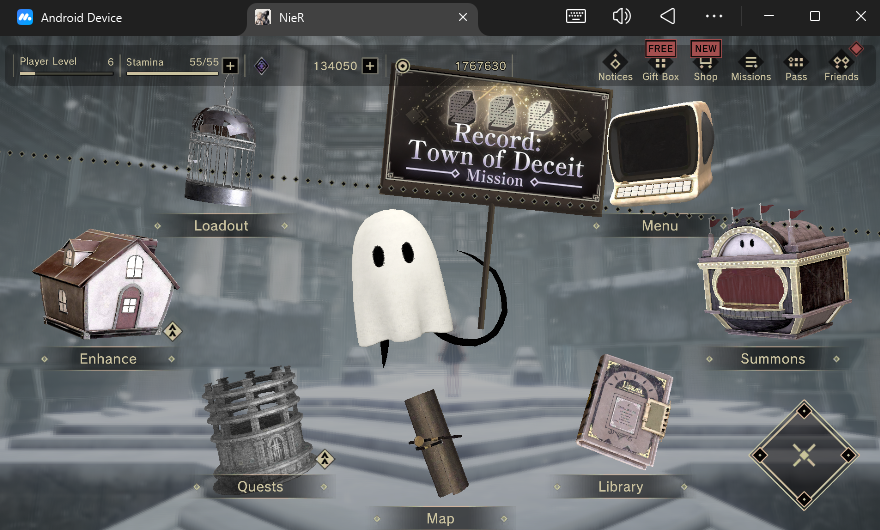{ loading=lazy }

7.3.2 - Select the Transfer Data option.

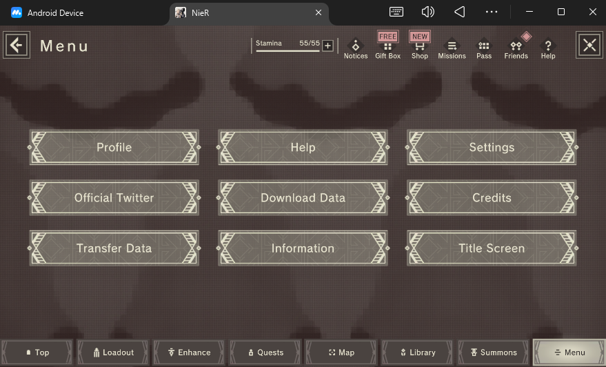{ loading=lazy }

7.3.3 - Select the Facebook sign in.

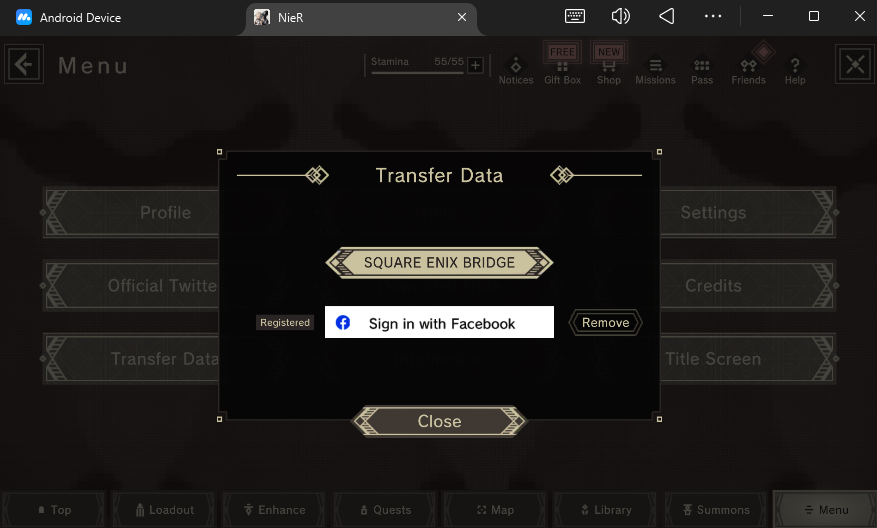{ loading=lazy }

7.3.4 - Choose an username and a password to create your account.

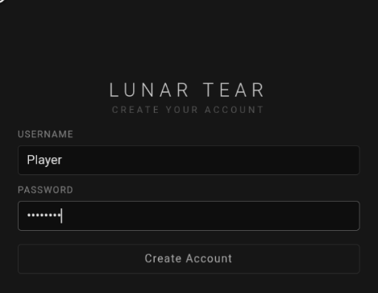{ loading=lazy }

###7.4 - Linking account to a new device

!!! note 
    Before you can log in to your account you must clear app data in the android settings.

7.4.1 - On the tittle screen press the button in the upper-right corner.

{ loading=lazy }

7.4.2 - Choose the Transfer Data option.

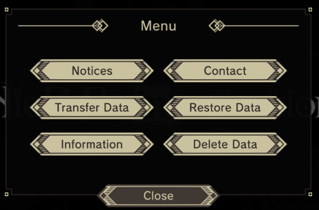{ loading=lazy }

7.4.3 - Press the Facebook button.

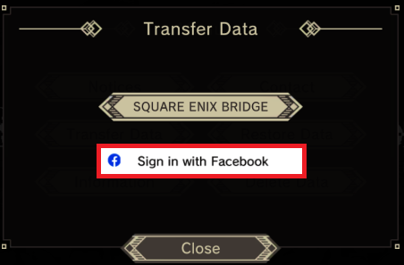{ loading=lazy }

7.4.4 - And sign in with your account.

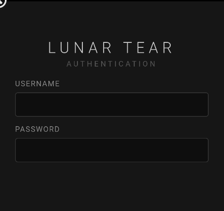{ loading=lazy }

!!! note
    Everytime you want to switch device you must transfer data. The game doesn't allow multiple devices.
	
!!! success
    Your server is now fully functional, so you can start enjoying the game! Have fun!
	
## 8 - Next Steps (Optional)

Now that you have a server up and running, you may want to play with friends or other people. To do so, you will need to set up a `Static IP` address and `Port Forwarding`.

Check the [Static IP](IP_guide.md) page to learn what to do next.