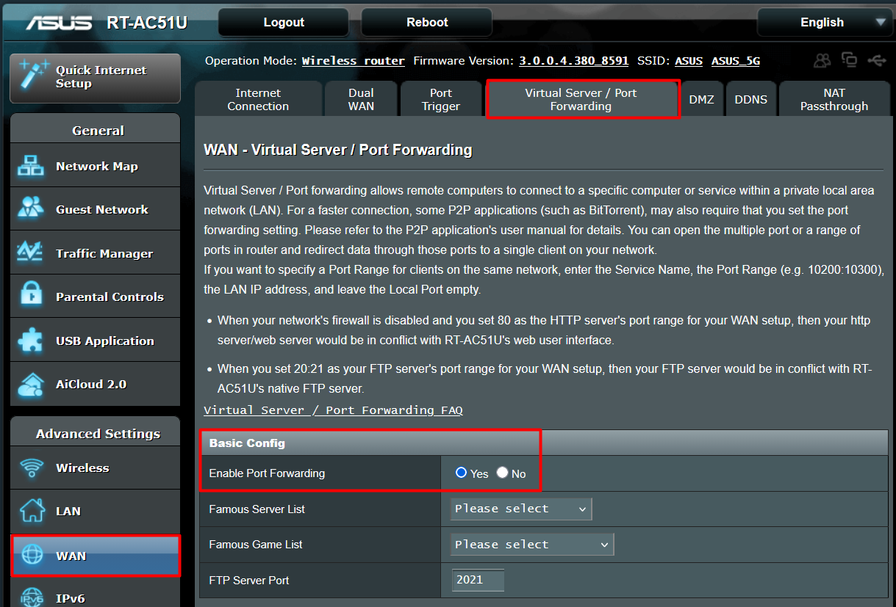
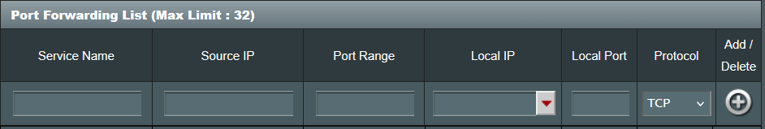
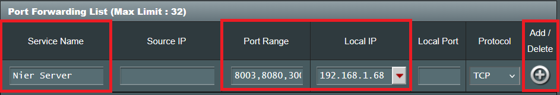
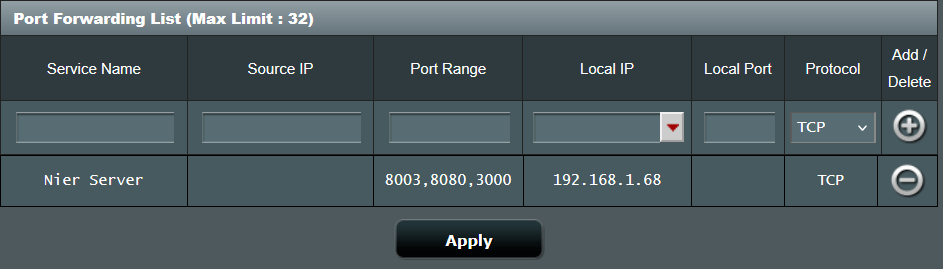

#Port Forwarding Guide (Advanced Users)

Now that you have set up your `Static IP`, you will need to open the ports. This is used to let a user connect from their computer to your server.

!!! warning
    This portion of the guide requires access to your home router. If you have never done this before, it is better to use a tool like `Tailscale`. Otherwise, you might mess up your internet settings.
	
## 1 - Port Forwarding

The process of enabling `Port Forwarding` via router varies between ISPs and router manufacturers. I will use my old home router (an Asus RT-AC51U) as an example. This will give you a rough idea on how to do it.

!!! tip
    If you mess up your router settings, don't worry. They all have a reset button, which is a tiny hole that you can press with a toothpick. Pressing it will restore the default settings.
	
And rememeber to check your router manufacturer website. Some have detailed guides on how to do this process.

### 1.1 - Login to your Router.

Copy the `Default Gateway` IP adress you got earlier in the Static IP Guide and paste it on your web browser.

!!! note
    Your IP address will be different from the one shown in the images. Use the IP address that appears in your `Command Prompt`.
	
{ loading=lazy }

The login page should load. Enter your username and password. Many routers have "admin" as the default username and password. Try that to see if it works. If not, search for your router model online.

``` batch
username: admin
password: admin
```

### 1.2 - WAN Settings

Select WAN in the Advanced Settings. Go to the "Virtual Server / Port Forwarding" and enable Port Forwarding.

{ loading=lazy }

Scroll until you see the "Port Forwarding List" section.

{ loading=lazy }

### 1.3 - Opening Ports

In the 'Service Name' field, enter the name you want. I chose 'Nier Server'. In the 'Port Range' field we need to enter the ports the server uses.

!!! note
    These ports are the same ones we used during the main setup guide.
	
{ loading=lazy }

Copy and paste the ports from bellow.

``` batch
8003,8080,3000
```

Enter the static IP address that we set up in the 'Static IP' section of the guide into the 'Local IP' field.

{ loading=lazy }

Press the "+" button to add the new settings and "Apply" button to save changes.

{ loading=lazy }
{ loading=lazy }

!!! success
    You now have a `Static IP` address and have enabled `Port Forwarding`! The final step is to obtain your public IP address, adjust the server settings and create the new APK.