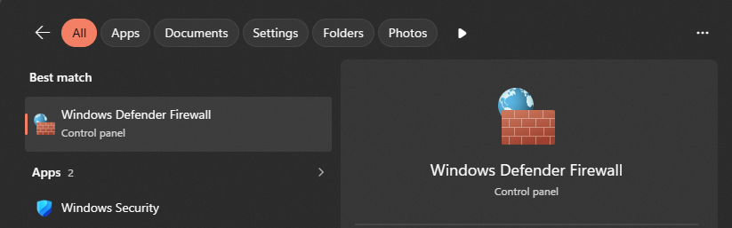
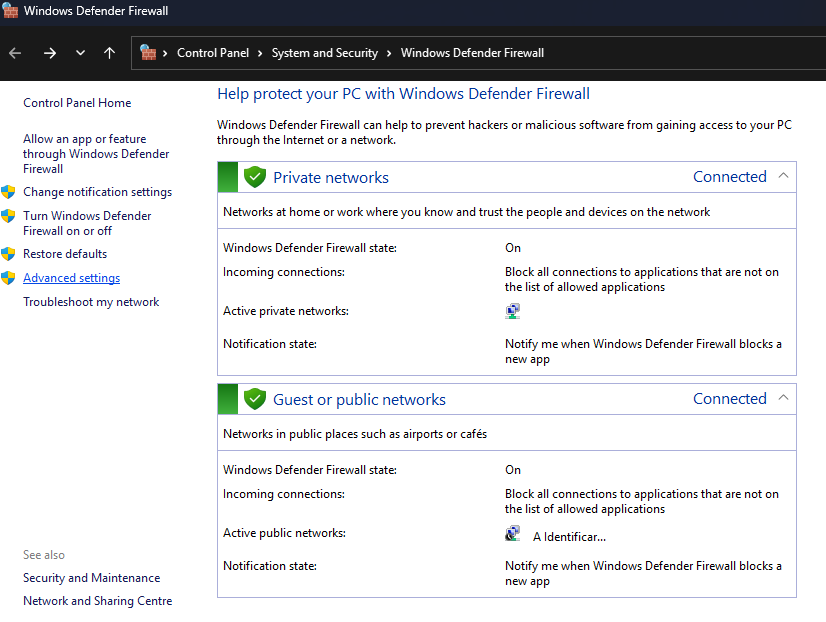
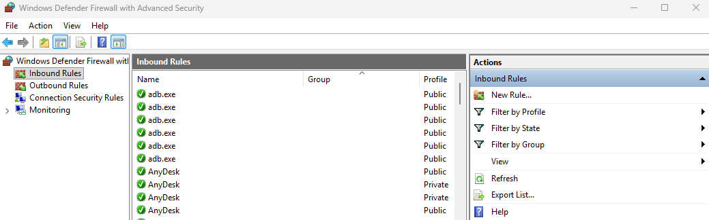
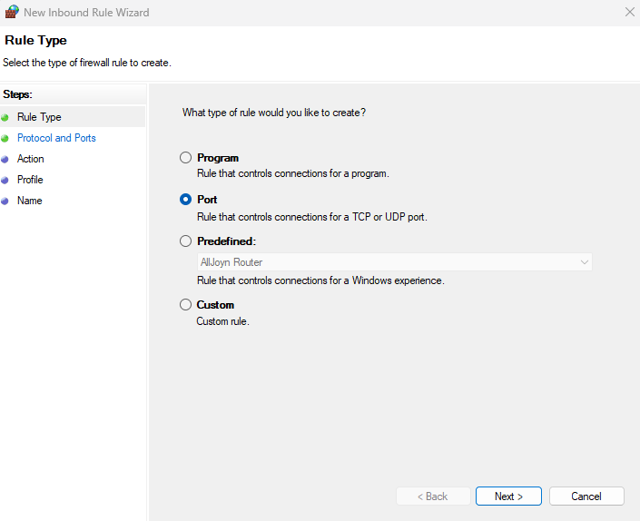
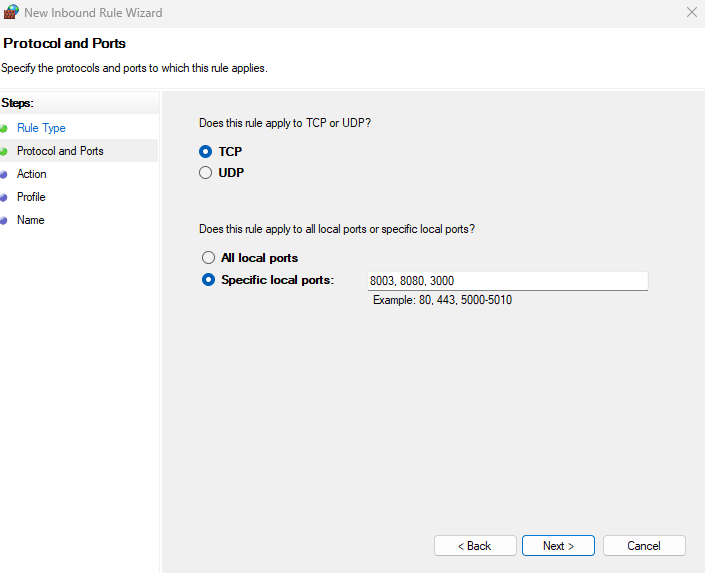
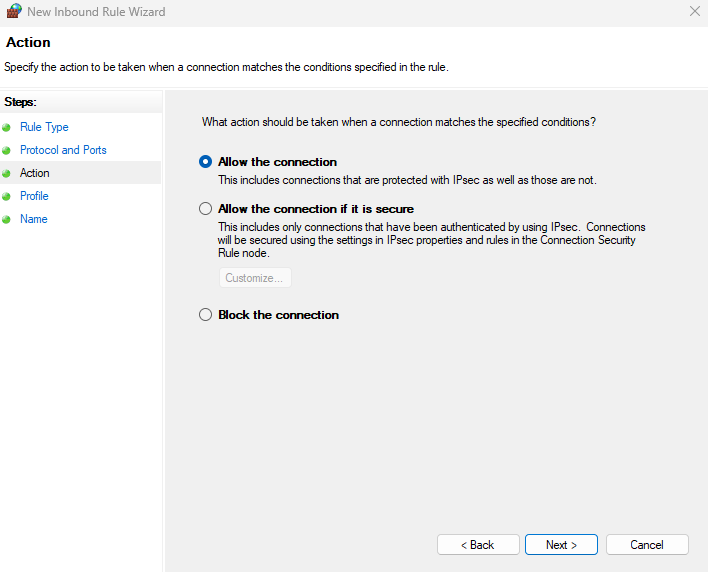
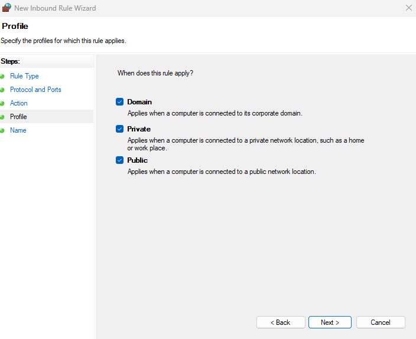
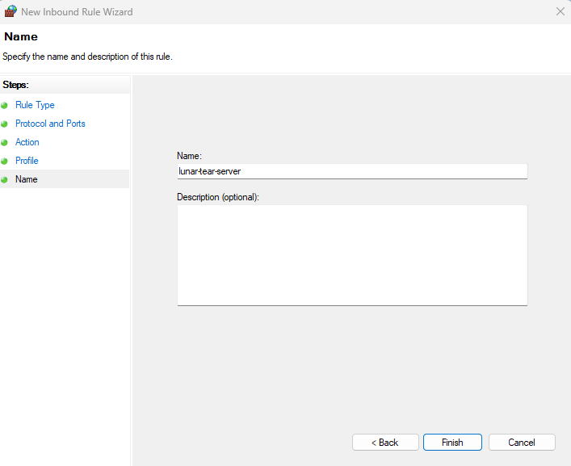
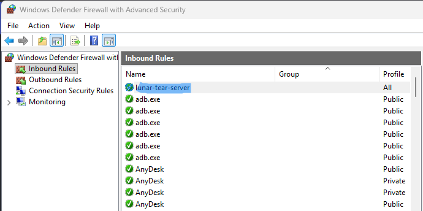
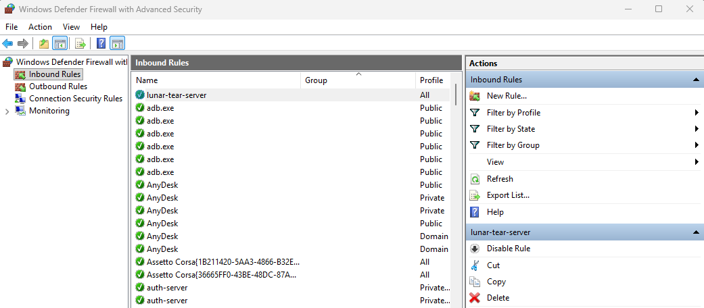

## 2 - Port Forwarding inside Windows (Easy way)

One way to enable port forwarding on Windows is to open the ports in the Windows Defender Firewall.

!!! info
    There is a very high chance that this won't work. Most of the time, `Port Forwarding` has to be done in the router settings. If you try this and it doesn't work, remember to undo the changes.
	
### 2.1 - Open Windows Defender Firewall

Type `Windows Defender Firewall` in Windows Search and press Enter.

{ loading=lazy }

Next click on `Advanced settings`.

{ loading=lazy }

### 2.2 - Creating a new rule

Select `Inbound Rules` and either right-click and press New Rule or select New Rule on the right side of the window.

{ loading=lazy }

Select Port and press Next.

{ loading=lazy }

!!! info
    You can also try creating the same Rule but choosing UDP.

Copy and paste the ports. Press Next to continue.

```batch
8003, 8080, 3000
```

{ loading=lazy }

Select Allow the connection and press Next.

{ loading=lazy }

Check all 3 options and press Next.

{ loading=lazy }

Give it a name you can easily identify `(ex: lunar-tear-server)` and press Finish.

{ loading=lazy }

Your new Rule will appear.

{ loading=lazy }

!!! info
    Again, there is a very high chance that this won't work. Most of the time, `Port Forwarding` has to be done in the router settings. If you attempt this method and it doesn't work, remember to undo the changes by deleting the Rule as outlined below.
	
###2.3 - Deleting a Rule

If the above didn't work it's best to delete the Rule we created. Just select your rule and either right-click and choose Delete or click  Delete on the right side of the window.

{ loading=lazy }